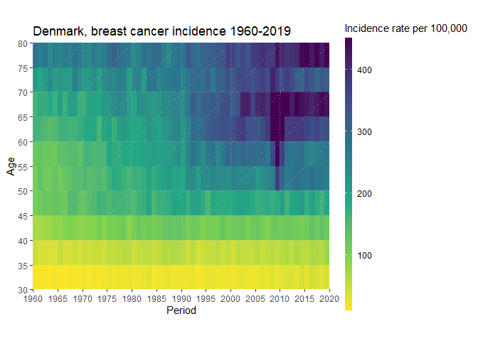
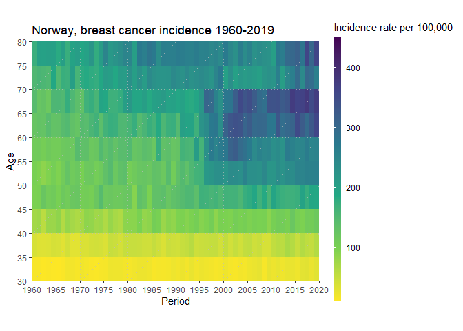
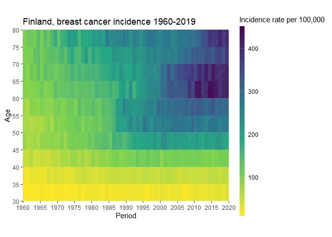

Lexis heatmaps of breast cancer incidence in four Nordic countries
================
Jakob Viuff
2022-08-30

``` r
df.dk <- read.csv("C:/Users/jviuff/Downloads/NCdata-tables-age-specific-rates-pop(208)-can(180)-incidence-females-y(1960-2019).csv")
df.sw <- read.csv("C:/Users/jviuff/Downloads/NCdata-tables-age-specific-rates-pop(752)-can(180)-incidence-females-y(1960-2019).csv")
df.no <- read.csv("C:/Users/jviuff/Downloads/NCdata-tables-age-specific-rates-pop(578)-can(180)-incidence-females-y(1960-2019).csv")
df.fi <- read.csv("C:/Users/jviuff/Downloads/NCdata-tables-age-specific-rates-pop(246)-can(180)-incidence-females-y(1960-2019).csv")

all.countries <- c("df.dk","df.sw","df.no","df.fi")
all.countries.labs <- c("Denmark", "Sweden", "Norway","Finland")
```

``` r
for (i in 1:length(all.countries)) {
print(
  get(all.countries[i]) %>%
  pivot_longer(X0:X85) %>% 
  rename(Period = Year) %>% 
  mutate(Age = as.integer(substring(name,2))) %>% 
  filter(Age >= 30, Age < 80) %>% 
    ggplot() + 
    geom_tile(aes(x = Period + 0.5, y = Age + 2.5, fill = value)) +
    scale_fill_viridis_c(option = "D", direction = -1, limits = c(10,450), oob = scales::squish) +
    coord_fixed() +
    scale_x_continuous(expand = c(0,0), name = "Period", breaks=seq(1960,2020,5)) +
    scale_y_continuous(expand = c(0,0), name = "Age", breaks=seq(30,80,5)) +
    guides(fill=guide_colourbar(title="Incidence rate per 100,000", barwidth = 0.5, barheight = 20)) +
    geom_vline(xintercept = seq(1960,2015,10), linetype="dotted", col = "grey", alpha = .7) +
    geom_hline(yintercept = seq(40,75,10), linetype="dotted", col = "grey", alpha = .7) +
    geom_abline(intercept = seq(-1980,-1870,10), slope = 1, linetype="dotted", col = "grey", alpha = .7) +
    labs(title=paste0(all.countries.labs[i],", breast cancer incidence 1960-2019"))
)
}
```

<!-- --><!-- --><!-- --><!-- -->
